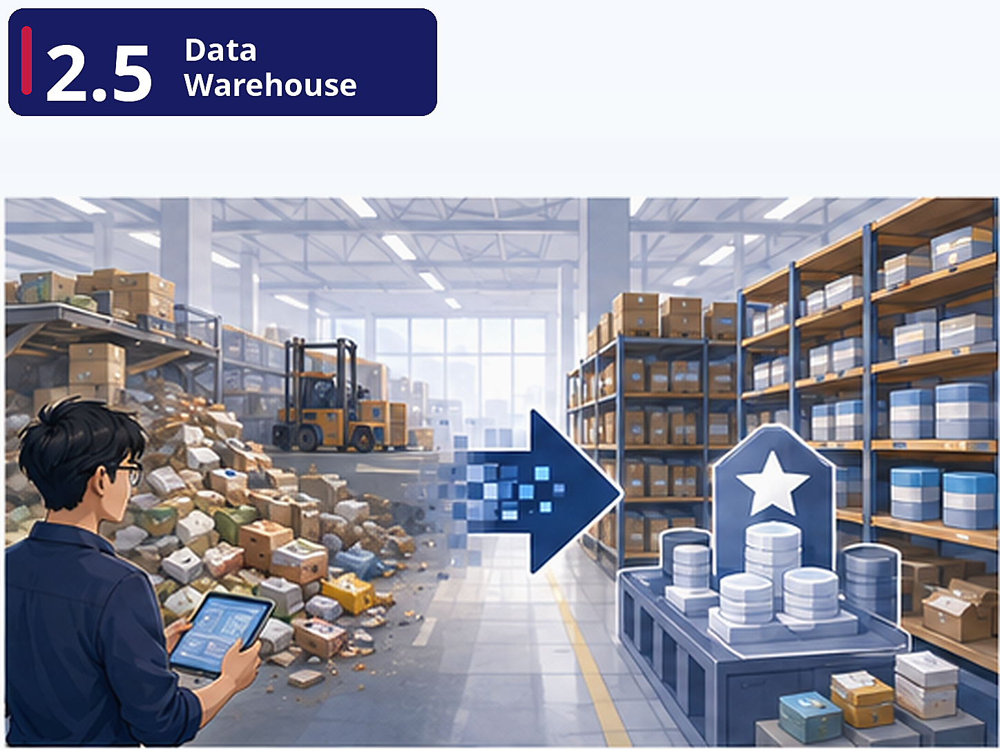

# Pre-class brief

## Where are we?

You've learned how to extract data and store it in various databases. But FreshCart's analysts can't query raw data from five different sources. They need a single, clean, trustworthy place to run their reports. This is the data warehouse — and it's the centrepiece of most data platforms. Your job now is to design the schema and build the transformation layer that turns raw data into analyst-ready tables.

## Why this matters

The data warehouse is typically the most business-critical piece of infrastructure a data engineer manages. It's where company KPIs are calculated, dashboards are powered, and executive decisions are informed. Getting the dimensional model right means analysts can self-serve. Getting it wrong means they keep asking you to write one-off queries — or worse, they get wrong numbers.

## Key concepts

**Dimensional Modelling (Star Schema)** — FreshCart's `fact_orders` table holds the measurable events (order amount, quantity, timestamps). Dimension tables (`dim_customer`, `dim_product`, `dim_store`) provide the context for slicing and dicing. Star schemas are simple to query, performant to scan, and intuitive for business users. This is arguably the most important design pattern in the entire module.

**ELT vs ETL** — In the cloud era, compute is cheap and storage is cheaper. Instead of transforming data *before* loading it (ETL), modern pipelines load raw data first, then transform it *inside* the warehouse (ELT). This shift explains why half the tools in this module exist.

**dbt as the Transformation Layer** — dbt lets you write transformations as SQL SELECT statements, version-control them in Git, test them, and document them. Your `dim_product` table is defined as code, not as a manual SQL script someone ran once. This is software engineering applied to analytics.

## Foundation

Revisit and review the following materials:

- Unit 1.2 - Introduction to Database
- Unit 1.4 - SQL Basic - DML
- Unit 1.5 - SQL Advanced
